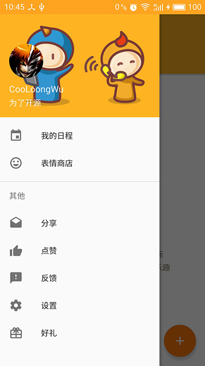
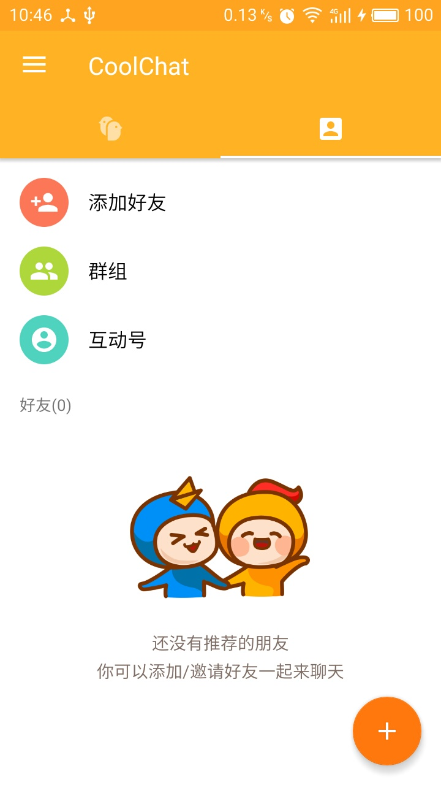
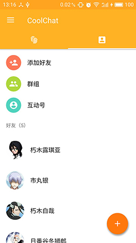
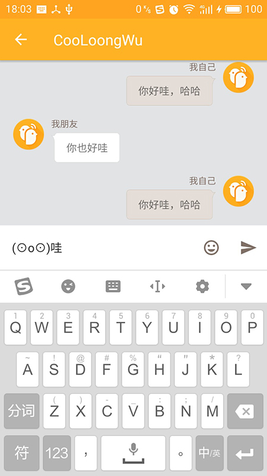
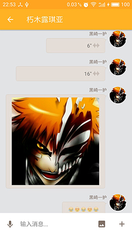
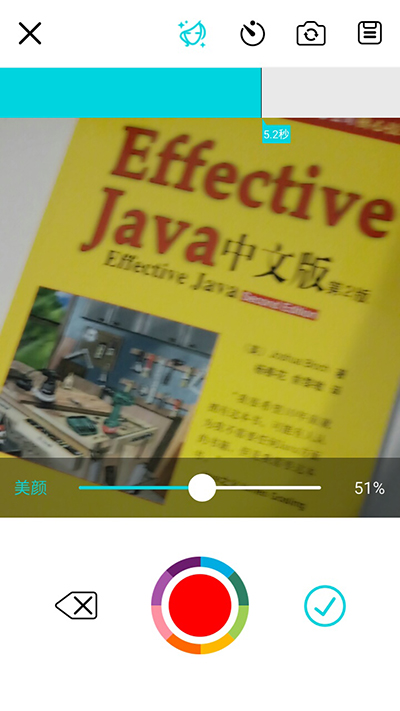
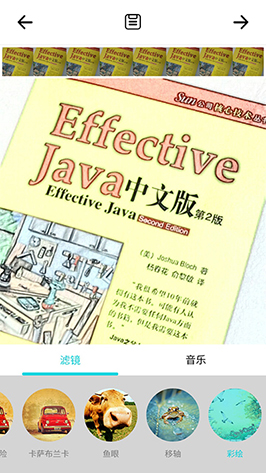
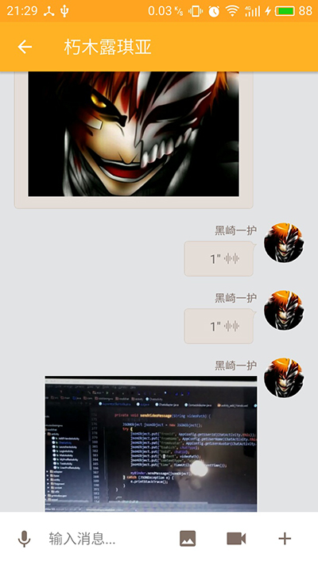

#CoolChat
这是一款高仿“一块”App（英文名：yeeCall）的即时通讯的开源客户端，目前正在进行开发，并逐步完善。
后期会将服务端等的源码也一并进行开源，敬请期待。

现在公司任务有点重，接下来客户端的开发可能会放缓，服务端我会先把创建群组的接口做好，然后在做客户端的群聊功能。

##测试账户
由于涉及到即时通讯，所以客户端需要跟服务器端建立Socket连接，服务端用的是我自己搭建的阿里云服务器，如需测试请在工作日时间
09:00-18:00的时间段内进行测试，其他时间服务器暂时不提供Socket连接服务（也就是无法聊天），登录等服务正常提供。
请测试新版的的用户先把之前安装的旧版卸载，再安装新版本。因为数据库表做了改动，现在还没正式完成App所以没有做兼容，出现闪退请卸载重新安装即可。

###用户列表
|用户ID|账号|用户名|密码|
|------|:----:|:----:|:----:|
|1  |1  |黑崎一护        |12345  |
|2  |2  |朽木露琪亚      |12345  |
|3  |3  |市丸银         |12345  |
|4  |4  |朽木白哉        |12345  |
|5  |5  |日番谷冬狮郎     |12345  |
|6  |6  |松本乱菊        |12345  |
|7  |7  |乌尔奇奥拉·西法  |12345  |

###好友关系
  <table>
        <tr>
            <th>用户</th>
            <th>黑崎一护</th>
            <th>朽木露琪亚</th>
            <th>市丸银</th>
            <th>朽木白哉</th>
            <th>日番谷冬狮郎</th>
            <th>松本乱菊</th>
            <th>乌尔奇奥拉·西法</th>
        </tr>
        <tr>
            <td>黑崎一护</td>
            <td></td>
            <td>√</td>
            <td>√</td>
            <td>√</td>
            <td>√</td>
            <td>√</td>
            <td></td>
        </tr>
        <tr>
            <td>朽木露琪亚</td>
            <td>√</td>
            <td></td>
            <td></td>
            <td>√</td>
            <td></td>
            <td></td>
            <td></td>
        </tr>
        <tr>
            <td>市丸银</td>
            <td>√</td>
            <td></td>
            <td></td>
            <td></td>
            <td></td>
            <td>√</td>
            <td></td>
        </tr>
        <tr>
            <td>朽木白哉</td>
            <td>√</td>
            <td>√</td>
            <td></td>
            <td></td>
            <td></td>
            <td></td>
            <td></td>
        </tr>
        <tr>
            <td>日番谷冬狮郎</td>
            <td>√</td>
            <td></td>
            <td></td>
            <td></td>
            <td></td>
            <td>√</td>
            <td></td>
        </tr>
        <tr>
            <td>松本乱菊</td>
            <td>√</td>
            <td></td>
            <td>√</td>
            <td></td>
            <td>√</td>
            <td></td>
            <td></td>
        </tr>
        <tr>
            <td>乌尔奇奥拉·西法</td>
            <td></td>
            <td></td>
            <td></td>
            <td></td>
            <td></td>
            <td></td>
            <td></td>
        </tr>
   </table>

##功能一览（未勾选的为待开发）
Android端项目做到后面越来越觉得没有一个服务端的话简直无法正常进行下去，所以现在服务端使用了Laravel框架来进行
简单的Api的开发。（说明：其实我对PHP框架并没有多少了解，一开始打算使用ThinkPHP5的框架来写，毕竟国人开发，文档看起来相对也轻松点，
但是部署后由于路由那一块搞得比较头大，于是就放弃TP5转而选择了目前国外比较流行的Laravel框架。就目前而言，路由、控制器、
数据库用起来都非常顺手，所以目前就暂定使用该框架了。）

短视频的拍摄使用了“趣拍云”的SDK，由于需要绑定签名，所以大家在测试的时候可能会出现不能拍摄的问题。后期我会将软件签名文件和
密码放出来供大家打包测试。

###Android端
- [x] **页面开发**
    - [x] 侧栏页面
    - [x] 聊天会话列表页面
    - [x] 联系人列表页面
    - [x] 与好友对话页面
- [x] **功能开发**
    -  [x] 进行Socket通信
    -  [x] 给好友发送消息
    -  [x] 聊天列表功能完成（实时刷新用户聊天内容）
    -  [x] 本地存储消息内容
    -  [x] 发送接收图片
    -  [x] 发送接收音频
    -  [x] 发送接收视频
    -  [ ] 给群组发送消息
    -  [ ] 添加、创建群组
    -  [ ] 添加好友

###服务端
- [x] 用户、好友列表、群组等数据库
- [x] 用户登录接口，暂不提供注册
- [x] 用户好友列表接口
- [x] 好友信息接口
- [ ] 用户群组列表接口

##已完成页面一览
因为目前只有我一人在做，PS和AI能力也不强，所以图标素材什么的各位估计也清楚怎么来的。  
如有侵权请告知，我会尽快删除并更换！  

     
     
     
     
     
     

##引用其他控件一览
该app在开发中也引用了大量的第三方优秀控件、框架和SDK，感谢这些开源的作者
- [Clans/FloatingActionButton][3]
- [square/picasso][4]
- [greenrobot/EventBus][5]
- [greenrobot/greenDAO ][6]
- [rockerhieu/emojicon][7]
- [hdodenhof/CircleImageView][8]
- [loopj/android-async-http][9]
- [lovetuzitong/MultiImageSelector][10]
- [Bilibili/ijkplayer][11]
- [七牛云][12]
- [趣拍云][13]

##已知Bug一览（带删除线的为已修复）
- ~~自己发消息超过两行，文字会超出屏幕~~
- ~~聊天列表页清空后没有展示空页面~~
- ~~发送消息后点击“+”按钮则无法再发送消息~~
- 弹出键盘时候聊天区域无法自动向上滚动
- 多图选择在魅蓝3手机中无法显示DCIM下的图片

##随意打赏我
由于在开发中租用阿里云服务器产生了相关费用，该费用目前都是我一人承担。
所以如果您觉得该项目对您有帮助，请随意打赏我。

|支付宝打赏|微信打赏|
|:----:|:----:|
|||


##License
```
Copyright 2015 CooLoongWu

Licensed under the Apache License, Version 2.0 (the "License");
you may not use this file except in compliance with the License.
You may obtain a copy of the License at

   http://www.apache.org/licenses/LICENSE-2.0

Unless required by applicable law or agreed to in writing, software
distributed under the License is distributed on an "AS IS" BASIS,
WITHOUT WARRANTIES OR CONDITIONS OF ANY KIND, either express or implied.
See the License for the specific language governing permissions and
limitations under the License.
```

[CooLoongWu][2]
2016 年 09月 12日 

[1]:https://cooloongwu.github.io/
[2]:http://blog.csdn.net/u010976213
[3]:https://github.com/Clans/FloatingActionButton
[4]:https://github.com/square/picasso
[5]:https://github.com/greenrobot/EventBus
[6]:https://github.com/greenrobot/greenDAO
[7]:https://github.com/rockerhieu/emojicon
[8]:https://github.com/hdodenhof/CircleImageView
[9]:https://github.com/loopj/android-async-http
[10]:https://github.com/lovetuzitong/MultiImageSelector
[11]:https://github.com/Bilibili/ijkplayer
[12]:http://www.qiniu.com/
[13]:https://www.qupaicloud.com/
