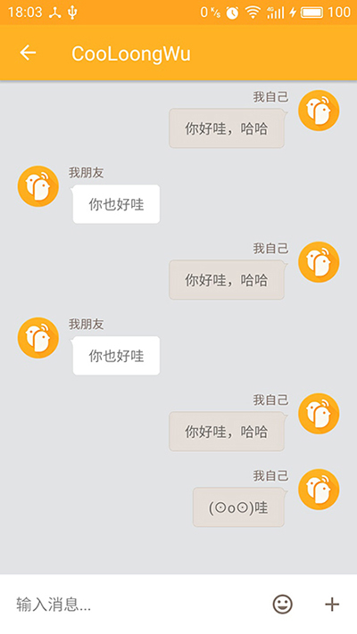

#CoolChat

这是一款高仿“一块”App（英文名：yeeCall）的即时通讯的开源客户端，目前正在进行开发，并逐步完善。
后期会将服务端等的源码也一并进行开源，敬请期待。

##功能一览（未勾选的为待开发）
- [x] **页面开发**
    - [x] 侧栏页面
    - [x] 聊天会话列表页面
    - [x] 联系人列表页面
    - [x] 与好友对话页面
- [x] **功能开发**
    -  [x] 给好友发送消息
    -  [ ] 给群组发送消息
    -  [x] 按钮，item点击水波纹效果
    -  [ ] 本地存储消息内容
    -  [x] 进行Socket通信

##已完成页面一览
因为目前只有我一人在做，PS和AI能力也不强，所以图标素材什么的各位估计也清楚怎么来的。  
如有侵权请告知，我会尽快删除并更换！  

     
     
     


##引用其他控件一览
该app在开发中也引用了大量的第三方优秀控件，感谢这些开源的作者
- [Clans/FloatingActionButton][3]
- [square/picasso][4]
- [greenrobot/EventBus][5]
- [greenrobot/greenDAO ][6]
- [rockerhieu/emojicon][7]
- [hdodenhof/CircleImageView][8]

##已知Bug一览（带删除线的为已修复）
- ~~自己发消息超过两行，文字会超出屏幕~~
- ~~聊天列表页清空后没有展示空页面~~
- ~~发送消息后点击“+”按钮则无法再发送消息~~
- 弹出键盘时候聊天区域无法自动向上滚动

##随意打赏我
由于在开发中租用阿里云服务器产生了相关费用，该费用目前都是我一人承担。
所以如果您觉得该项目对您有帮助，请随意打赏我。

|支付宝打赏|微信打赏|
|:----:|:----:|
|||


##License
```
Copyright 2015 CooLoongWu

Licensed under the Apache License, Version 2.0 (the "License");
you may not use this file except in compliance with the License.
You may obtain a copy of the License at

   http://www.apache.org/licenses/LICENSE-2.0

Unless required by applicable law or agreed to in writing, software
distributed under the License is distributed on an "AS IS" BASIS,
WITHOUT WARRANTIES OR CONDITIONS OF ANY KIND, either express or implied.
See the License for the specific language governing permissions and
limitations under the License.
```

[CooLoongWu][2]
2016 年 09月 12日 

[1]:https://cooloongwu.github.io/
[2]:http://blog.csdn.net/u010976213
[3]:https://github.com/Clans/FloatingActionButton
[4]:https://github.com/square/picasso
[5]:https://github.com/greenrobot/EventBus
[6]:https://github.com/greenrobot/greenDAO
[7]:https://github.com/rockerhieu/emojicon
[8]:https://github.com/hdodenhof/CircleImageView
